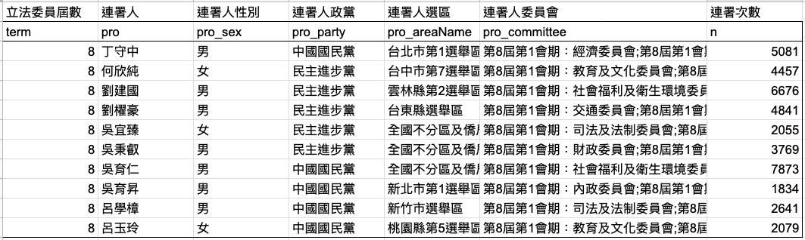
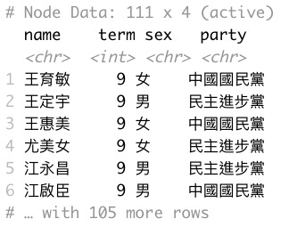

<style type="text/css">

.remark-slide-content {
    padding: 1em 1em 1em 1em;
    font-size: 28px;
}

.my-one-page-font {
  padding: 1em 1em 1em 1em;
  font-size: 20px;
  /*xaringan::inf_mr()*/
}

</style>

```{r message=FALSE,warning=FALSE,echo=FALSE}
library(dplyr)
library(tidyverse)

### read data
df_index <- read_csv("data/df_index.csv")
df_legislator <- read_csv("data/df_legislator.csv")
df_legislator_expand_info <- read_csv("data/df_legislator_expand_info.csv")
df_party_english <- read_csv("data/df_party_english.csv")
df_legislator_8to10 <- read_csv("data/df_legislator_8to10.csv")
df_cosponsor_09 <- df_legislator_expand_info %>% dplyr::filter(term == 9)
network_cosponsor_09 <- df_cosponsor_09 %>%
  dplyr::filter(n >= 30) %>%
  dplyr::select(from = pro, to = cos, weight = n) %>% 
  tidygraph::as_tbl_graph(directed = T)
```

# 自我介紹

<ul>
<li>個人背景
    <ul>
    <li>商學院畢業/新聞所就讀中</li>
    <li>數據分析實習</li>
    </ul>
<li>Interest
    <ul>
    <li>資料分析領域</li>
    <li>資料新聞領域</li>
    </ul>
<li>R
    <ul>
    <li>套件: tidyverse 相關,如 dplyr, tidyr, purrr, ggplot2</li>
    <li>data cleaning, data manipulation, data visualization; <br>social network analysis; data mining; text mining</li>
    </ul>
<li>更多
    <ul>
    <li><a href="https://medium.com/dd-story-hub" target="_blank">跟朋友一起開的 Medium</a></li>
    <li><a href="https://dennisrdatanews.netlify.com/">我的部落格</a></li>
</li>
</ul>

---

# Agenda

<ul>
<li>大綱
    <ul>
    <li>網絡分析的基本概念</li>
    <li>套件介紹: <code>tidygraph</code> 以及 <code>ggraph</code></li>
    <li>以台灣立法委員提案與連署網絡資料為例</li>
    </ul>
</li>
</ul>
<ul>
<li>預期
    <ul>
    <li>適合對 R 語言有基礎且不排斥 tidyverse 的人</li>
    <li>適合對 network analysis 有了解想在 R 裡面將結果視覺化的人</li>
    <li>適合用過 igraph 但對它不夠滿意的人</li>
    <li>不適合想產出設計師等級超精美圖表的人</li>
    <li>不適合想聽學術政治分析的人</li>
    </ul>
</li>
</ul>

---
class: my-one-page-font

# 什麼時候會用到網絡分析 - 長方形資料01

```{r tabular-data, out.width='90%', out.height='90%',echo=FALSE}

```

--

```{r message=FALSE,warning=FALSE,eval=FALSE}
library(tidyverse)
# 按照被連署次數多到少排序
df_aggregate %>% arrange(desc(n))
# 找名字包含"平"者
df_aggregate %>% filter(str_detect(pro, "平"))
# 找各黨派被連署次數最多
df_aggregate %>% group_by(party) %>% summarise(n = max(n))
```
---

class: my-one-page-font

# 什麼時候會用到網絡分析 - 長方形資料02

```{r out.width='90%', out.height='90%',echo=FALSE}

```

--

```{r message=FALSE,warning=FALSE,eval=FALSE}
library(tidyverse)
# 找出最挺每位提案委員的連署人是誰
df_raw %>% group_by(pro) %>% arrange(desc(n)) %>% 
  filter(row_number() == 1)
# 看各黨連署的黨派組成
df_raw %>% group_by(pro_party, cos_party) %>% summarise(n = sum(n)) %>%
  arrange(pro_party, desc(cos_party))
```

---
# "時機若對，我第一個使用網絡分析"

<ul>
<li>很好解決的問題
    <ul>
    <li>誰提案最多？誰提案最少？</li>
    <li>最常幫國民黨立委連署的民進黨立委是誰？</li>
    <li>親民黨幫民進黨立委連署佔比有多高？</li>
    </ul>
<br>    
--
<li>不太好解決的問題
    <ul>
    <li>誰最重要？誰跟大家關係最好？</li>
    <li>以丁守中為例，誰跟他距離最遠？</li>
    <li>兩大黨哪個在連署上比較緊密？</li>
    <li>連署上有沒有派系？有沒有一群人很邊緣？</li>
    </ul>
</ul>

---
# 網絡分析概念 - 關心重點與問題對應

<ul>
<li>關心重點
    <ul>
    <li>關心個體之間的關係，以及這些關係組成的結構</li>
    <li>舉例：前立委<b>徐永明</b>提案次數重要、誰幫他連署也重要</li>
    </ul>
</li>
</ul>
--
<ul>
<li>問題對應
    <ul>
    <li>重要 / centrality: 誰最重要？誰跟大家關係最好？</li>
    <li>距離 / distance  : 以丁守中為例，誰跟他距離最遠？</li>
    <li>緊密 / betweeness: 兩大黨哪個在連署上比較緊密？</li>
    <li>分群 / community : 連署有沒有派系？有沒有人很邊緣？</li>
    </ul>
</li>
</ul>

---
# 網絡分析概念 - 基本組成與特徵

<ul>
<li>基本組成
    <ul>
    <li>個體 - nodes/vertices/actors</li>
    例如立法委員、學術論文、PTT網軍
    <li>關係 - edges/links/bonds</li>
    例如連署關係、引用關係、推噓文
    </ul>
</li>
</ul>
--
<ul>
<li>個體與關係都有特徵
    <ul>
    <li>個體有性質，例如黨派、性別</li>
    <li>關係有方向與強度，方向如引用與被引用、強度如引用次數</li>
    </ul>
</li>
</ul>

---
# 範例 - 黃國昌提案的連署網絡

```{r out.width='75%', out.height='75%',echo=FALSE, fig.align = "center"}

```

.center[2020 第九屆立委黃國昌提案的連署情形 by 我自己]

---
# 網絡分析概念 - 網絡資料長相

```{r out.width='40%', out.height='40%',echo=FALSE}


```

.pull-left[nodes]

.pull-right[edges]

---
# 什麼時候會用到網絡分析 - 分析對象

<ul>
<li>大群體中的個體
    <ul>
    <li>立法委員裡面的提案狂魔</li>
    <li>學術領域裡面的重要論文</li>
    <li>朋友當中的認識王</li>
    </ul>
<br>    
--
<li>大群體中的次群體
    <ul>
    <li>屬於政黨內的派系</li>
    <li>高中生會同時申請的科系</li>
    <li>PTT 推文網軍集團</li>
    </ul>
</ul>
---
# 實例 - 人際網絡與政治獻金

```{r out.width='50%', out.height='50%',echo=FALSE}


```

.pull-left[2008 「快樂會傳染、請你慷慨」研究 <br>  by [紐約時報](https://archive.nytimes.com/www.nytimes.com/imagepages/2008/12/05/health/05happyA.ready.html?action=click&module=RelatedCoverage&pgtype=Article&region=Footer)]

.pull-right[2016 台灣立委與總統選舉(合法)政治獻金收受網絡 - 以柯建銘為例 <br>  by [鏡週刊](https://www.mirrormedia.mg/projects/political-contribution/#/explore)]

---
# 實例 - PTT 與立委連署

```{r out.width='50%', out.height='50%',echo=FALSE}


```

.pull-left[2019 PTT 八掛版 <br> 共同推文關係網絡(節選) <br>  by [Steven Yeo](https://www.syviz.me/post/%E5%93%88%E5%9B%89-%E4%BD%A0%E6%98%AF%E7%B6%B2%E8%BB%8D%E5%97%8E-ptt%E6%8E%A8%E6%96%87%E9%97%9C%E4%BF%82%E8%A6%96%E8%A6%BA%E5%8C%96/)]

.pull-right[2020 第八屆立法委員國民兩黨互相連署情形(節選) <br> by 我自己]

---
class: my-one-page-font

# 從 tabular 到 network - 提案連署資料

```{r message=FALSE,warning=FALSE}
df_index %>% slice(10) %>% select(1,3,7,8,9,13) %>%
  kableExtra::kable("html") %>%
  kableExtra::kable_styling(bootstrap_options = c("striped", "hover"))
```

---
class: my-one-page-font

# 從 tabular 到 network - 立委資料

```{r message=FALSE,warning=FALSE}
df_legislator %>% head(5) %>% select(1,2,3,4,5,6,7) %>%
  kableExtra::kable("html") %>%
  kableExtra::kable_styling(bootstrap_options = c("striped", "hover"))
```

---
class: my-one-page-font

# 從 tabular 到 network - 清理後的資料

```{r message=FALSE,warning=FALSE}
df_cosponsor_09 %>% slice(101:105) %>% select(3,1,5,6,2,12,13,4) %>%
  kableExtra::kable("html") %>%
  kableExtra::kable_styling(bootstrap_options = c("striped", "hover"))
```

---

# 來看程式碼跟 code

<ul>
<li><a href = "https://dennishi0925.github.io/satRdays_sharing_2020_slide/sharing_slide#1">簡報連結</a></li>
<li><a href = "https://github.com/Dennishi0925/satRdays_sharing_2020">程式碼連結</a>
<ul>
    <li>igraph 基本 - igraph.R</li>
    <li>用 tidygraph 分析立委資料 - tutorial.R</li>
    <li>data 資料夾 - 第九屆立委連署資料</li>
    </ul>
</li>
</ul>

---

# 「瀟灑走一回」 - 匯入與清理資料

<ul>
<li>Data Importing
    <ul>
    <li><a href = "https://data.ly.gov.tw/getds.action?id=20">立法院開放資料服務平台</a></li>
    <li>欄位包含屆別, 會期, 提案名稱, 提案人, 連署人等</li>
    <li>原始格式: json/xml/csv</li>
    </ul>
</li>
</ul>
--
<ul>
<li>Data Munging
    <ul>
    <li>目的 - 從提案的「事件資料」到以立委為單位的「關係資料」</li>
    原始: 提案 A/B, 連署C/D/E; 關係: 提案A, 連署D, 共n次
    <li>流程 - 清提案資料、串立委資料、依照提案與連署匯總</li>
    <li>幾個重點 - 姓名、空白、原始錯誤</li>
    異體字/錯字/傳統姓名、key in 錯誤、"%C2%A0"
    </ul>
</li>
</ul>
---

# 套件介紹 - [tidygraph](https://github.com/thomasp85/tidygraph)

<ul>
<li>特色
    <ul>
    <li>"provides a tidy API for graph/network manipulation"</li>
    <li>"While network data itself is not tidy, it can be envisioned as two tidy tables, one for node data and one for edge data."</li>
    <li><code>tidyverse</code> 生態系底下的套件，很多互通的概念</li>
    <li>整理 <code>igraph</code> 的函數，變得很有一致性</li>
    </ul>
</li>
</ul>
--
<ul>
<li>函數
    <ul>
    <li>centrality - <code>centrality_()</code></li>
    <li>community detection - <code>group_()</code></li>
    <li>node measures - <code>node_is_()</code>, <code>node_rank()</code></li>
    <li>edge measures - <code>edge_is_()</code></li>
    <li>graph measures - <code>graph_is_()</code></li>
    </ul>
</li>
</ul>

---

# 套件介紹 - [ggraph](https://github.com/thomasp85/ggraph)
<ul>
<li>特色
    <ul>
    <li>"A grammar of graphics for relational data"</li>
    <li>"an extension of ggplot2 aimed at supporting relational data structures such as networks, graphs, and trees"</li>
    <li>畫網絡圖時遵循 <code>ggplot2</code> 的繪圖文法</li>
    <li>有跟 <code>tidygraph</code> 整合</li>
    </ul>
</li>
</ul>
--
<ul>
<li>組成
    <ul>
    <li>layout - 畫出網絡的架構</li>
    <li>nodes - <code>geom_node_()</code></li>
    <li>edges - <code>geom_edge_()</code></li>
    </ul>
</li>
</ul>

---
# 再回去基本定義一下

<ul>
<li>組成 - nodes and edges
    <ul>
    <li>edge 可以有方向性(direction)</li>
    <li>edge 可以有權重(weight)</li>
    <li>node 可以自己連自己(self-loop)</li>
    <li>node 之間可以不只有一個連結</li>
    </ul>
</li>
<li>表示方法
    <ul>
    <li>adjacency matrix</li>
    <li>adjacency list</li>
    </ul>
</li>
</ul>
---
# 再回去基本定義兩下

<ul>
<li>neighbor and degree
    <ul>
    <li>size - 組成個數</li>
    <li>neighbor - 鄰居</li>
    <li>degree - 鄰居個數</li>
    <li>degree distribution - 鄰居個數的分佈</li>
    </ul>
</li>
<li>connectivity
    <ul>
    <li>path - 從 A 到 B 有多遠 (a sequence of edges)</li>
    <li>connected - graph 的任兩點都有連接</li>
    <li>connected component - graph 的某部分任兩點都有連結</li>
    <li>distance - 從 A 到 B 的最短距離</li>
    <li>diameter - graph 當中最長的任兩點最短距離</li>
    <li>cluster - global and local (看triangles)</li>
    </ul>
</li>
</ul>

---
# 再回去基本定義三下

<ul>
<li>其他
    <ul>
    <li>weak ties</li>
    <li>embeddedness</li>
    <li>structure holes</li>
    <li>degree distribution - 鄰居個數的分佈</li>
    </ul>
</li>
<li>觀察真實生活中的網絡
    <ul>
    <li>average path length 的長短</li>
    <li>connected component 的大小</li>
    <li>clustering coefficient 的大小/li>
    <li>structure 的模組化程度</li>
    <li>degree distribution 是否有 scale-free 特性</li>
    </ul>
</li>
</ul>

---
# 再回去基本定義最後一下

<ul>
<li>centrality - 判斷哪個 node 重要 (重要的定義很多樣) <br>
    <ul>
    <li>degree centrality - 直接算有多少鄰居，比數量</li>
     意義 - 直接跟他人有聯繫(朋友多)
    <li>closeness centrality - 計算最短距離的平均，比距離</li>
    意義 - 用相對短距離接觸到他人(朋友的朋友多)
    <li>betweenness centrality - 計算處在最短距離的次數，比關鍵度</li>
    意義 - 處於很多最短距離上(關鍵人物)
    <li>eigenvector centrality - 計算鄰居的重要性分數，比分數高低</li>
    意義 - 鄰居重要程度決定自己重要程度(厲害的人成為朋友)
    </ul>
</li>
<li>ranking
    <ul>
    <li>pagerank - Google 搜尋排序</li>
    <li>hubs and authorities - 重要論文</li>
    </ul>
</li>
</ul>

---
# 構築網絡資料 - tbl_graph()

<ul>
<li><code>tbl_graph()</code> - 兩個 dataframe
    <ul>
    <li>nodes = df_nodes</li>
    <li>edges = df_edges</li>
    <li>directed, node_key</li>
    </ul>
</li>
</ul>
<ul>
<li><code>as_tbl_graph()</code> - 一個 dataframe
    <ul>
    <li>x = df_nodes_edges</li>
    <li>weight = n</li>
    </ul>
</li>
</ul>
---
# 操作網絡資料 - activate()

<ul>
<li><code>activate()</code> - 兩個 dataframe
    <ul>
    <li><code>activate(nodes)</code></li>
    <li><code>activate(nodes)</code></li>
    </ul>
</li>
</ul>
<ul>
<li>跟<code>tidyverse</code>的整合
    <ul>
    <li><code>filter(), mutate(), select(), etc.</code></li>
    <li><code>left_join(), inner_join()</code></li>
    <li><code>as_tibble()</code></li>
    
    </ul>
</li>
</ul>

---
# 可以回答問題了！

<ul>
<li>問題對應
    <ul>
    <li>重要 / centrality: 誰最重要？誰跟大家關係最好？</li>
    <li>距離 / distance  : 以丁守中為例，誰跟他距離最遠？</li>
    <li>緊密 / betweeness: 兩大黨哪個在連署上比較緊密？</li>
    <li>分群 / community : 連署有沒有派系？有沒有人很邊緣？</li>
    </ul>
</li>
</ul>

<ul>
<li>函數族群
    <ul>
    <li><code>centrality</code></li>
    <li><code>node_pairs</code></li>
    <li><code>node_is</code></li>
    <li><code>group</code></li>
    </ul>
</li>
</ul>

---
class: my-one-page-font

# 誰重要？

<ul>
<li>不用網絡也可以
    <ul>
    <li>連署次數最多/最少的立委</li>
    <li>被連署最多/最少的立委</li>
    <li>被連署人數最多/最少的立委</li>
    </ul>
</li>
</ul>

```{r message=FALSE,warning=FALSE,eval=FALSE}
# 用網絡方法
network_bill_09 %>% 
  activate(edges) %>% 
  filter(weight >= 50) %>%
  activate(nodes) %>%
  mutate(centrality_degree = centrality_degree(),
         centrality_closeness = centrality_closeness(),
         centrality_betweenness  = centrality_betweenness()) %>%
  arrange(desc(centrality_degree)) %>%
  select(name, party, centrality_degree)
# 用tabular
df_bill_pro_cos_09 %>%
  filter(n >= 50) %>%
  group_by(pro) %>% summarise(degree = n_distinct(cos)) %>%
  arrange(desc(degree))
```

---
# 黨派內部與跨黨交流？

<ul>
<li>跨黨派互動
    <ul>
    <li>幫自己黨派以外連署</li>
    <li>泛藍/泛綠各自幫忙</li>
    <li>國民黨/民進黨互相幫忙</li>
    </ul>
</li>
</ul>

```{r message=FALSE,warning=FALSE,eval=FALSE}
# 用網絡方法
df_bill_pro_cos_09 %>% filter(pro_party != cos_party) %>%
  filter((pro_party == "中國國民黨" & cos_party == "民主進步黨") | (cos_party == "中國國民黨" & pro_party == "民主進步黨")) %>%
  count(pro, pro_party, cos, cos_party, sort = T)
```

---
# 連署集團特性

<ul>
<li>以整體來看(graph) & 看政黨
    <ul>
    <li>現實 - 泛藍與泛綠</li>
    <li>電腦 - 兩大集團/li>
    <li><code>group_()</code></li>
    <li><a href = "https://tidygraph.data-imaginist.com/reference/group_graph.html">reference</a></li>
    </ul>
</li>
</ul>

```{r message=FALSE,warning=FALSE,eval=FALSE}
# 用網絡方法
df_bill_pro_cos_09 %>%
  select(from = pro, to = cos, weight = n) %>% 
  as_tbl_graph(directed = F) %>% 
  activate(nodes) %>%
  mutate(group_louvain =
           as.character(group_louvain(weights = weight)))
```

---
# 關心關說的特定人士

<ul>
<li>跟徐永明的距離
    <ul>
    <li>一對節點之間的關係(node pairs relation)</li>
    <li><code>node_distance_to()</code></li>
    <li><code>node_similarity_with()</code></li>
    <li>判斷特定節點性質</li>
    <li><code>node_is_center()</code></li>
    <li><code>node_is_keyplayer()</code></li>
    </ul>
</li>
</ul>

```{r message=FALSE,warning=FALSE,eval=FALSE}
# 用網絡方法
df_bill_pro_cos_09 %>%
  select(from = pro, to = cos, weight = n) %>% 
  as_tbl_graph(directed = F) %>% 
  mutate(center = node_is_center(),
         distance_Hsu_all = node_distance_to(
  name == "徐永明", mode = "all", weights = weight))
```

---
# 其他問題、概念、函數

<ul>
<li>Edge measures
    <ul>
    <li><code>edge_is_multiple()</code></li>
    <li><code>edge_is_loop()</code></li>
    </ul>
</li>
</ul>
<ul>
<li>Graph measures
    <ul>
    <li><code>graph_is_connected()</code></li>
    <li><code>graph_component_count()</code></li>
    </ul>
</li>
</ul>
<ul>
<li>Graph creation
    <ul>
    <li><code>create_ring()</code></li>
    <li><code>create_bipartite()</code></li>
    </ul>
</li>
</ul>

---

# 看一下畫圖

<ul>
<li>組成
    <ul>
    <li><code><a href = "https://ggraph.data-imaginist.com/reference/ggraph.html">ggraph(graph, layout = '')</a></code></li>
    <li><code>geom_edge_()</code></li>
    <li><code>geom_node_()</code></li>
    </ul>
</li>
</ul>
<ul>
<li>看更多
    <ul>
    <li><code><a href = "https://github.com/schochastics/graphlayouts">library(graphlayouts)</a></code> - 提供更多 layout</li>
    <li><code><a href = "https://datastorm-open.github.io/visNetwork/">library(visNetwork)</a></code> - 互動圖表選項</li>
    <li><code><a href = "http://christophergandrud.github.io/networkD3/">library(visNetwork)</a></code> - 互動圖表選項</li>
    </ul>
</li>
</ul>
---
# 一些學術與實務角度

<ul>
<li>學術
    <ul>
    <li>立法表態模型 - 用連署向選民表達立場</li>
    <li>立法資訊模型 - 對其他委員傳遞訊號</li>
    <li>連署網絡模型 - 人際網絡扮演重要角色</li>
    <li>投票 vs. 提案 - 清楚表達政治意志 vs. 自主表達</li>
    <li>台灣連署維度 - a.泛藍泛綠分歧 b.小黨與其他議題</li>
    </ul>
</li>
</ul>
--
<ul>
<li>實務：連署/提案的意義
    <ul>
    <li>連署原因 - 眾多，熟識、幫忙、認同理念</li>
    <li>重要程度 - 主提案 > 提案 > 投票 >> 連署</li>
    <li>立委類型(分區/不分區、自己專業/非自己專業)</li>
    </ul>
</li>
</ul>

---

# Further Resource
<ul>
<li>Articles
    <ul>
    <li><a href = "https://shirinsplayground.netlify.com/2018/03/got_network/?utm_campaign=News&utm_medium=Community&utm_source=DataCamp.com">Another Game of Thrones network analysis</a></li>
    <li><a href = "https://researchblog.duke.edu/2018/02/06/duke-scholars-bridge-disciplines-to-tackle-big-questions/">Duke Scholars Bridge Disciplines to Tackle Big Questions</a></li>
    <li><a href = "http://talks.schochastics.net/netVizR/slides.html"> Network Vizualization Slide by Schochastics</a></li>
    
    </ul>
</li>
</ul>
<ul>
<li>Courses
    <ul>
    <li>李宣緯老師 - <a href = "https://sites.google.com/view/hsuanweilee/teaching/social-and-economic-networks">Social and Economic Networks</a></li>
    <li><a href = "https://www.coursera.org/learn/social-economic-networks">Coursera courses<a></li>
    </ul>
</li>
</ul>

---

class: inverse, center, middle

# Thanks 

```{r out.width='95%', out.height='95%',echo=FALSE, fig.align = "center"}
knitr::include_graphics("image/chang_major_hub")
```
